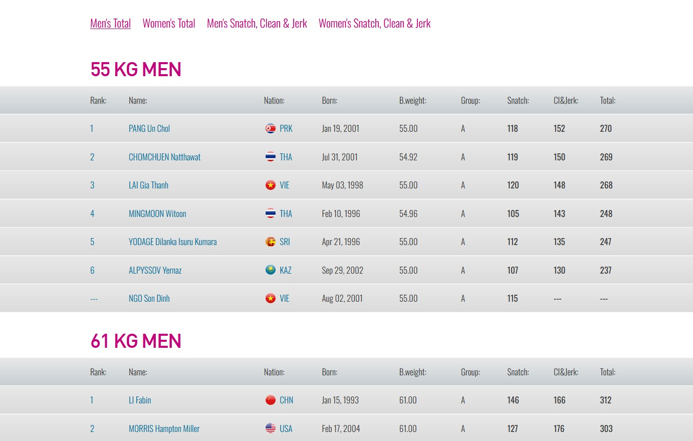

# 🏋️‍♀️ Web Scraping IWF Competition Data Using Beautiful Soup and Fuzzy Wuzzy 💪
## Note:  Parts of this project involved using proprietary data, so only the web scraping portion of the code will work. The name and country fuzzy matching, along with dataframe merging, won't function because the proprietary dataframe is not included in the repository.

## Direct Link to Jupyter Notebook
---
[IWF BeautifulSoup Web Scrape Script](./code/webscrape.ipynb)

## Background
---
The International Weightlifting Federation (IWF) website provides extensive information on the sport, including event results filtered by type, age, and nation, athlete profiles, news, and an event calendar. This project will focus on web scraping data specifically from the  [World Cup Event in Phuketk, Thailand](https://iwf.sport/results/results-by-events/?event_id=599).

## Problem Statement
---
The objective is to develop a web scraping process to collect data from the IWF World Cup in Phuket, Thailand. The data to be collected includes:
- Athlete ame
- Country
- Results from all three Snatch attempts
- Results from all three Clean & Jerk lift attempts
- Totl successful lift weight
  
The site organizes data by weight class and further categorizes results by lift type and totals for men and women.  The following screenshot illustrates how the data is visually presented.

After collecting the data, the next step is to create features that indicate whether each athlete's lift attempt was successful. Finally, the collected data will be merged with the proprietary dataset that was included. Although the code for merging is provided in the notebook, it will not function since the proprietary dataset is not included.

## Resources
* 2024.09.12/ChatGPT accessed
* Referenced [repository](https://github.com/jwc20/iwf_api/blob/main/iwf/result.py) by [jwc20](https://github.com/jwc20)
---
## Dataset Dictionary
---
|Dataset|Type|Source|Description|
|---|---|---|---|
|**phuket_2024.csv**|*Generated*|BeautifulSoup Script|CSV data generated from using BeautifulSoup for webscraping and feature engineering

## Process
---
This code pulls weightlifting data from the 2024 IWF World Cup Paris Qualifying Event webpage using web scraping. The data is organized into three categories: snatch, clean and jerk, and total lift. The process involves:

- Using [BeautifulSoup](https://www.crummy.com/software/BeautifulSoup/) to extract the relevant content within the 'results__container' div, focusing on IDs for 'men_snatchjerk' and 'women_snatchjerk'.
- For each category, it identifies 'cards' divs, iterating through groups to scrape individual lifts.
- Different list setups were used for each lift category: snatch data was extracted from every third group starting with the first, clean and jerk from every third group starting with the second, and total lift from every third group starting with the third.
- Three loops collect data for each lift (snatch, clean and jerk, and total lift), which is stored in separate lists.
- These lists are then converted into dataframes, and the data is merged based on the competitor's name into a final consolidated dataframe.

After data is scraped and collected into a dataframe, the next step involves creating features to indicate whether an athlete successfully completed each lift. This includes checking the validity of weight values and transforming them into a usable format for analysis.
- Defining a function, lift_success_check, to determine if a lift was successful by verifying if the weight value is a NavigableString and not equal to '---' (a strikethrough means a lift was unsuccessful), creating Boolean columns to reflect these results.
- Establishing another function, int_transformer, to convert weight values into integers, replacing '---' with 0 to facilitate calculations.
- Creating lists of column names to organize which functions should be applied.
- Applying the lift_success_check function to the relevant columns in the dataframe to generate success metrics.
- Utilizing the int_transformer function to ensure all weight values are converted into integers for further analysis.

Finally, a fuzzy matching algorithm using FuzzyWuzzy to align athlete names and countries from the web-scraped dataset with those in the proprietary dataset. The process ensures accurate merging of data by considering both name similarity and country matches.
- The fuzzy_name_merge function iterates through each row of the proprietary dataset, comparing names and countries.
- It calculates a similarity score using the token_set_ratio and adds a 20-point bonus if the countries match.
- The function keeps track of the best match and corresponding score, returning them as tuples.
- The resulting tuples are unpacked into new columns, best_match and match_score, in the proprietary dataset.
- The web-scraped dataset is then merged with the proprietary dataframe based on the best_match column.
- The final dataframe is cleaned and organized for future analysis.

## Feature Dictionary For Web Scaped Data (
---
|Feature|Type|Description|
|---|---|---|
|**name**|*string*|Athlete name
|**country**|*string*|Athlete country
|**snatch1**|*integer*|Weight in kg of athelete's first snatch lift attempt
|**snatch2**|*integer*|Weight in kg of athelete's second snatch lift attempt
|**snatch3**|*integer*|Weight in kg of athelete's third snatch lift attempt
|**cj1**|*integer*|Weight in kg of athelete's first clean & jerklift attempt
|**cj2**|*integer*|Weight in kg of athelete's second clean & jerklift attempt
|**cj3**|*integer*|Weight in kg of athelete's third clean & jerklift attempt
|**total**|*integer*|Total weight in kg that athelete successfully lifted
|**snatch1_success**|*bool*|Athelete's success on first snatch lift.  True is as successful lift.  False is unsuccessful.
|**snatch2_success**|*bool*|Athelete's success on second snatch lift.  True is as successful lift.  False is unsuccessful.
|**snatch3_success**|*bool*|Athelete's success on third snatch lift.  True is as successful lift.  False is unsuccessful.
|**cj1_success**|*bool*|Athelete's success on first clean & jerk lift.  True is as successful lift.  False is unsuccessful.
|**cj2_success**|*bool*|Athelete's success on second clean & jerk lift.  True is as successful lift.  False is unsuccessful.
|**cj3_success**|*bool*|Athelete's success on third clean & jerk lift.  True is as successful lift.  False is unsuccessful.

# Challenges and Conclusion
---
Before starting this project, my experience with BeautifulSoup was primarily limited to simple website scraping tasks. The IWF (International Weightlifting Federation) website, however, presented a much more complex structure than I had encountered before. I found myself spending a day carefully analyzing the site’s HTML, paying close attention to how different categories were structured and how the page reacted to user interactions. During this exploration, I stumbled upon a GitHub repository where someone had successfully scraped IWF results. This discovery was crucial, as it highlighted the significance of the result_container class in the site's structure. While I had already identified the role of the cards div class in site navigation, understanding how to work with result_container became a key breakthrough.

Initially, I was familiar with using the find_all method in BeautifulSoup to locate elements within a page’s HTML. However, this project pushed me to expand my skill set by learning how to slice into tags to extract specific pieces of data. This new technique allowed me to delve into critical categories such as ‘snatch,’ ‘clean and jerk,’ and ‘total,’ enabling me to access more granular data points within those categories. This added a layer of precision to the data extraction process, which was essential for creating a comprehensive dataset. Once I collected the data into a DataFrame, my goal was to create a Boolean check for the lift data, indicating whether a lift was successful or not. However, I faced an unexpected challenge: the weights were stored as NavigableString objects instead of standard strings. This issue prompted me to write a custom function to handle these objects, ensuring that the weights could be extracted and converted into integers, which was crucial for future feature engineering tasks, such as calculating averages or totals.

The most significant challenge I encountered during this project was merging the scraped datasets. Since the data did not include a unique ID for each competitor, I initially attempted to use the FuzzyWuzzy library to match competitors based on their names. However, I quickly realized that many names were out of order or had slight variations, making exact matches difficult. Despite experimenting with different FuzzyWuzzy methods, including token_set_ratio, I still faced a few mismatched names. To tackle this issue, I drew on an analogy from my chemistry background, where confirmation methods are used to verify the presence of compounds. I applied a similar concept to the name-matching process by introducing a secondary check based on the competitors’ countries. If the country matched, I assigned a bonus to the match score, which ultimately led to a 100% successful merge. This process taught me a valuable lesson about the importance of creating robust data validation steps, especially when working with messy or incomplete datasets.

While setting up the merge function, I also gained valuable experience with the iterrows method, which allowed me to loop through each row of the scraped data and match competitors based on both their names and countries. Additionally, I learned how to "unzip" values using the asterisk (*) character—a technique that was new to me and proved useful for simplifying some of the list operations I performed throughout the project. 

Ultimately, I was able to successfully scrape requested data from the IWF 2004 Phuket results website and merge it to the proprietary dataset.

# Room For Improvements
---
If I had more time, I would have focused on further refining the final dataset. For instance, some competitors who did not have rankings were left with empty rank columns, and a few rows were missing age data. I would have also streamlined the code by combining functions for renaming columns to snake case, adding Boolean columns for lift success, and converting weights to integers. Furthermore, I would have simplified the naming conventions  the name and country matching process to avoid variable naming conflicts, especially with the country_x and country_y columns that appeared after merging the data.

Overall, this project has significantly deepened my expertise in BeautifulSoup, HTML navigation, and web scraping. I now feel much more confident in tackling complex data extraction tasks. Recently, I've been working with sumo wrestling results through an API, but this project has better prepared me to scrape data from websites like the Japan Sumo Association directly. I truly appreciate the opportunity to apply and grow my skills through this challenge.